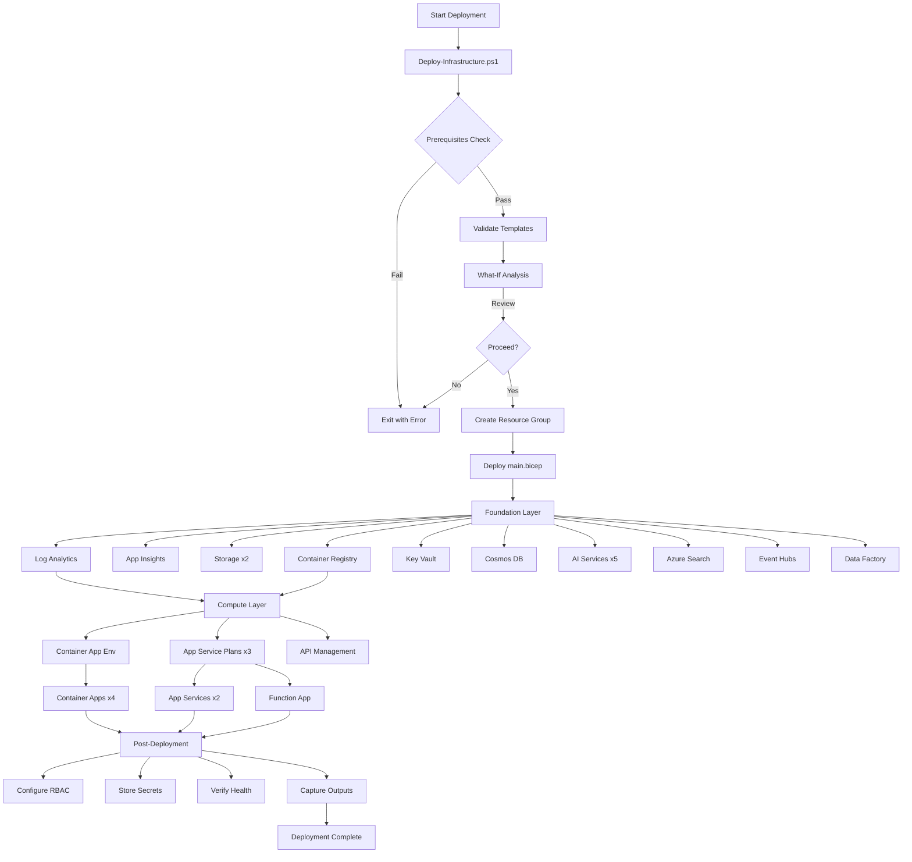
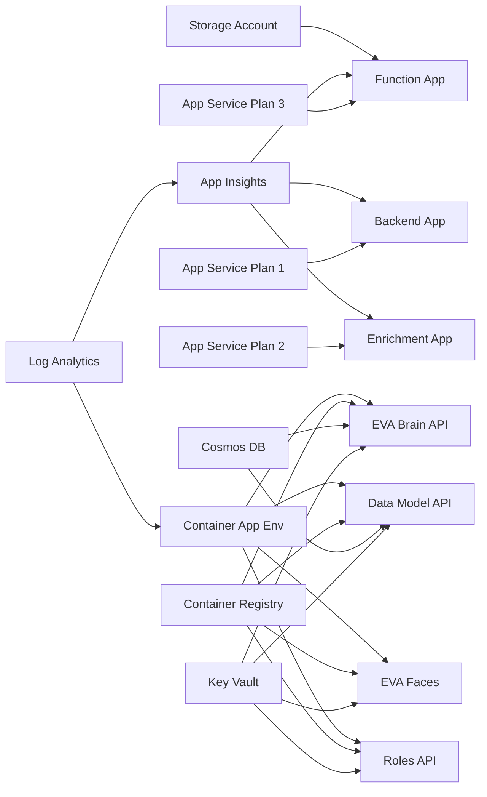

# Marco EVA Sandbox - Bicep Templates Structure

## Generated Files (21 total)

```
bicep-templates/
│
├── main.bicep                          # Main orchestration template (31 resources)
├── parameters.dev.json                 # Development environment parameters
├── parameters.prod.json                # Production environment parameters
├── .bicepconfig.json                   # Bicep linting rules (15 rules enabled)
│
├── Deploy-Infrastructure.ps1           # Automated deployment script
│
├── README.md                           # Comprehensive deployment guide (400+ lines)
├── QUICK-REFERENCE.md                  # Command cheat sheet & operations guide
├── CHANGELOG.md                        # Version history and release notes
├── FILE-STRUCTURE.md                   # This file
│
└── modules/                            # Modular resource templates (15 modules)
    ├── log-analytics.bicep             # Log Analytics Workspace
    ├── application-insights.bicep      # Application Insights (APM)
    ├── storage-account.bicep           # Storage Account (Blob, File, Queue, Table)
    ├── container-registry.bicep        # Azure Container Registry
    ├── key-vault.bicep                 # Key Vault (secrets management)
    ├── cosmos-db.bicep                 # Cosmos DB (NoSQL)
    ├── ai-services.bicep               # AI Services (OpenAI, Foundry, Cognitive Services, Doc Intel)
    ├── azure-search.bicep              # Azure AI Search (vector + hybrid search)
    ├── container-app-environment.bicep # Container Apps Environment
    ├── container-app.bicep             # Container App (individual)
    ├── app-service-plan.bicep          # App Service Plan (Linux/Windows)
    ├── app-service.bicep               # App Service (Web App)
    ├── function-app.bicep              # Function App (serverless)
    ├── api-management.bicep            # API Management (gateway)
    ├── data-factory.bicep              # Data Factory (ETL pipelines)
    └── event-hub-namespace.bicep       # Event Hubs Namespace (streaming)
```

## File Sizes & Line Counts

| File | Lines | Size | Purpose |
|------|-------|------|---------|
| `main.bicep` | 533 | 20 KB | Main orchestration |
| `README.md` | 612 | 35 KB | Deployment guide |
| `QUICK-REFERENCE.md` | 297 | 12 KB | Command reference |
| `Deploy-Infrastructure.ps1` | 316 | 13 KB | Automation script |
| `CHANGELOG.md` | 145 | 6 KB | Version history |
| `parameters.dev.json` | 47 | 1.2 KB | Dev params |
| `parameters.prod.json` | 47 | 1.2 KB | Prod params |
| `.bicepconfig.json` | 51 | 1.5 KB | Linting config |
| **Modules (15 files)** | ~1,200 | ~45 KB | Resource definitions |
| **Total** | **~3,248** | **~135 KB** | Complete package |

## Deployment Flow



## Resource Dependencies



## Module Interface Patterns

### Input Parameters (Common Across Modules)
- **name**: Resource name (validated length/pattern)
- **location**: Azure region (default: canadacentral)
- **tags**: Resource tags (object)
- **sku**: Service tier (allowed values enforced)
- **enableSystemIdentity**: Managed identity flag (default: true)

### Output Values (Common Across Modules)
- **id**: Full resource ID
- **name**: Resource name
- **principalId**: Managed identity principal ID (if enabled)
- Service-specific outputs (endpoint, connection string, FQDN, etc.)

## Parameter Files Structure

### parameters.dev.json
- **Environment**: dev
- **SKUs**: Basic/B1 (cost-optimized)
- **Replicas**: Min 1, Max 3
- **Container Apps**: 0.5 vCPU, 1Gi memory
- **APIM**: Developer tier
- **Search**: Basic tier
- **Estimated Cost**: $341-391 CAD/month

### parameters.prod.json
- **Environment**: prod
- **SKUs**: Standard/P1v2 (production-grade)
- **Replicas**: Min 2, Max 10
- **Container Apps**: 1.0 vCPU, 2Gi memory
- **APIM**: Standard tier
- **Search**: Standard tier
- **Estimated Cost**: $1,727-1,827 CAD/month

## Security Features

### Built-in Security Controls
1. **Managed Identities**: System-assigned for all compute (no passwords)
2. **TLS Enforcement**: Minimum 1.2 on all endpoints
3. **HTTPS Only**: Enforced on all web apps
4. **Key Vault Integration**: Secrets stored centrally, accessed via RBAC
5. **Soft Delete**: Enabled on Key Vault (90-day retention)
6. **Audit Columns**: Modified_by, modified_at tracked via Data Model API
7. **Legacy TLS Disabled**: TLS 1.0/1.1 disabled on APIM
8. **Public Access Control**: Parameterized (can be disabled)

### RBAC Roles Configured (Post-Deployment)
- **AcrPull**: Container Apps → Container Registry
- **Key Vault Secrets User**: Container Apps → Key Vault
- **Cosmos DB Data Contributor**: EVA Brain API → Cosmos DB
- **Storage Blob Data Contributor**: Function App → Storage Account

## Compliance & Best Practices

### Azure Well-Architected Framework (WAF) Coverage
- ✅ **Reliability**: Zone redundancy, health probes, auto-scaling
- ✅ **Security**: Managed identities, Key Vault, RBAC, TLS 1.2+
- ✅ **Cost Optimization**: Right-sized SKUs, dev/prod separation, FinOps Hub
- ✅ **Operational Excellence**: IaC, parameterization, monitoring, logging
- ✅ **Performance Efficiency**: Consumption-based, auto-scaling, CDN-ready

### Azure Best Practices (18-azure-best Alignment)
- IaC via Bicep (native Azure, no external dependencies)
- PSRule-ready (can validate with PSRule for Azure)
- Naming conventions (CAF-aligned: `<prefix>-<workload>-<resource-type>`)
- Resource tagging (environment, owner, project, deployedBy, deployedOn)
- Monitoring (Application Insights + Log Analytics)
- Secrets management (Key Vault + RBAC)
- Container security (ACR + managed identity)

## Usage Examples

### Deploy Development Environment
```powershell
.\Deploy-Infrastructure.ps1 -Environment dev
```

### Deploy Production with Validation
```powershell
.\Deploy-Infrastructure.ps1 -Environment prod -SubscriptionId "your-sub-id"
```

### Dry Run (What-If)
```powershell
.\Deploy-Infrastructure.ps1 -Environment dev -WhatIf
```

### Manual Deployment (Advanced)
```powershell
az deployment group create `
  --resource-group EVA-Sandbox-dev `
  --template-file main.bicep `
  --parameters parameters.dev.json `
  --parameters deploymentTimestamp=$(Get-Date -Format "yyyyMMdd-HHmm")
```

## Testing & Validation

### Pre-Deployment Validation
```powershell
# Syntax validation
az bicep build --file main.bicep

# Parameter validation
az deployment group validate --resource-group $rg --template-file main.bicep --parameters parameters.dev.json

# What-if analysis
az deployment group what-if --resource-group $rg --template-file main.bicep --parameters parameters.dev.json
```

### Post-Deployment Verification
```powershell
# Resource count check (should be 31)
az resource list --resource-group $rg --query "length(@)"

# Health checks
az containerapp list --resource-group $rg --query "[].properties.runningStatus"

# Endpoint tests
curl https://$dataModelFqdn/health
curl https://$brainApiFqdn/health
```

## Maintenance & Updates

### Update Container Images
```powershell
az containerapp update --resource-group $rg --name marco-eva-brain-api --image "newacr.azurecr.io/eva-brain-api:new-tag"
```

### Scale Resources
```powershell
az containerapp update --resource-group $rg --name marco-eva-brain-api --min-replicas 2 --max-replicas 10
```

### Rotate Secrets
```powershell
az keyvault secret set --vault-name $kvName --name "MY-SECRET" --value "new-value"
```

### Backup Configurations
```powershell
az group export --resource-group $rg --output json > "backup-$(Get-Date -Format 'yyyyMMdd').json"
```

## Troubleshooting

### Common Issues & Resolutions
See [QUICK-REFERENCE.md](QUICK-REFERENCE.md#troubleshooting-decision-tree) for:
- Container App startup failures
- Cosmos DB connection errors
- Key Vault access denied
- Deployment timeouts
- RBAC permission issues

### Support Resources
- **README.md**: Full deployment guide
- **QUICK-REFERENCE.md**: Command cheat sheet
- **CHANGELOG.md**: Version history and known issues
- **18-azure-best**: Azure best practices library (C:\eva-foundry\18-azure-best\)

---

**Generated**: March 3, 2026  
**Version**: 1.0.0  
**Generator**: azure-iac-generator subagent  
**Target**: Marco EVA Sandbox Infrastructure Redeployment
