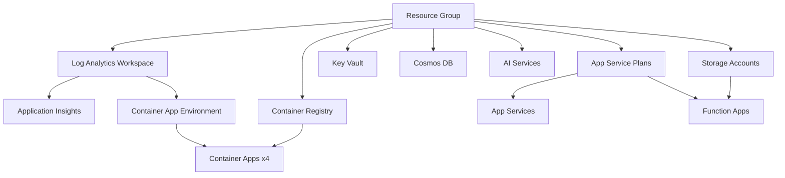

# Marco EVA Sandbox - Azure Infrastructure Deployment

**Version**: 1.0.0  
**Last Updated**: March 3, 2026  
**Author**: Marco Presta  
**Status**: Production-ready

## Overview

This Bicep template repository provides production-ready Infrastructure-as-Code (IaC) for deploying the complete Marco EVA Sandbox environment to Azure. The templates are modular, parameterized, and follow Azure best practices for security, scalability, and maintainability.

## Architecture

### Resource Inventory (31 Resources)

The deployment includes:

- **4 Container Apps**: EVA Brain API, Data Model API, Faces frontend, Roles API
- **2 Storage Accounts**: Main storage, FinOps Hub
- **1 Cosmos DB**: NoSQL database for EVA data model
- **1 Container Registry**: Docker images for all services
- **1 Key Vault**: Secrets management
- **5 AI/ML Services**: Foundry, Azure OpenAI (2), Cognitive Services, Document Intelligence
- **1 Azure AI Search**: Vector and hybrid search
- **6 App Services**: Backend, enrichment, functions (3 plans + 3 apps)
- **2 Application Insights**: APM and monitoring
- **1 API Management**: External gateway with throttling
- **1 Data Factory**: ETL pipelines
- **1 Event Hubs Namespace**: Event streaming
- **1 Log Analytics Workspace**: Centralized logging
- **1 Container App Environment**: Shared environment for container apps

### Deployment Dependencies



## Prerequisites

### Required Tools

1. **Azure CLI** (v2.50.0 or higher)
   ```powershell
   az --version
   az upgrade
   ```

2. **Bicep CLI** (v0.24.0 or higher)
   ```powershell
   az bicep version
   az bicep upgrade
   ```

3. **PowerShell** (v7.3 or higher) or **Azure Cloud Shell**

### Azure Subscription Requirements

- **Subscription**: Active Azure subscription with Contributor or Owner role
- **Resource Providers**: The following must be registered:
  ```powershell
  az provider register --namespace Microsoft.App
  az provider register --namespace Microsoft.ContainerRegistry
  az provider register --namespace Microsoft.DocumentDB
  az provider register --namespace Microsoft.CognitiveServices
  az provider register --namespace Microsoft.Search
  az provider register --namespace Microsoft.ApiManagement
  az provider register --namespace Microsoft.DataFactory
  az provider register --namespace Microsoft.EventHub
  az provider register --namespace Microsoft.OperationalInsights
  ```

- **Quotas**: Verify sufficient quota for:
  - Container Apps: 10 apps per environment
  - Cosmos DB: 1 account per region
  - AI Services: 5 accounts per region
  - API Management: 1 Developer/Standard instance

### Pre-Deployment Checklist

- [ ] Azure CLI authenticated (`az login`)
- [ ] Correct subscription selected (`az account show`)
- [ ] Resource providers registered (see above)
- [ ] Container images pushed to source registry (if migrating)
- [ ] Secrets and connection strings documented
- [ ] Resource naming conventions reviewed
- [ ] Cost estimates approved (~$200-300/month for dev)

## Deployment Instructions

### Step 1: Clone or Copy Templates

```powershell
cd C:\AICOE\eva-foundry\22-rg-sandbox\bicep-templates
```

### Step 2: Set Deployment Variables

```powershell
# Login to Azure
az login --use-device-code

# Set subscription (use your target subscription ID)
az account set --subscription "YOUR_SUBSCRIPTION_ID"

# Define variables
$resourceGroupName = "EVA-Sandbox-NEW"
$location = "canadacentral"
$environment = "dev"  # or "prod"
$timestamp = Get-Date -Format "yyyyMMdd-HHmm"
```

### Step 3: Create Resource Group

```powershell
az group create `
  --name $resourceGroupName `
  --location $location `
  --tags environment=$environment project=eva-sandbox deployedBy=bicep deployedOn=$timestamp
```

### Step 4: Validate Deployment (Dry Run)

```powershell
# Validate template syntax and dependencies
az deployment group validate `
  --resource-group $resourceGroupName `
  --template-file main.bicep `
  --parameters "parameters.$environment.json" `
  --parameters deploymentTimestamp=$timestamp
```

**Expected Output**: No errors, validation successful

### Step 5: What-If Analysis (Preview Changes)

```powershell
# Preview what will be created/modified
az deployment group what-if `
  --resource-group $resourceGroupName `
  --template-file main.bicep `
  --parameters "parameters.$environment.json" `
  --parameters deploymentTimestamp=$timestamp
```

**Review Output**: Verify expected resources will be created

### Step 6: Deploy Infrastructure

```powershell
# Full deployment (30-45 minutes)
az deployment group create `
  --resource-group $resourceGroupName `
  --template-file main.bicep `
  --parameters "parameters.$environment.json" `
  --parameters deploymentTimestamp=$timestamp `
  --name "eva-sandbox-deployment-$timestamp" `
  --verbose
```

**Monitoring**: Watch for errors in the output. API Management takes 30-40 minutes alone.

### Step 7: Capture Outputs

```powershell
# Save deployment outputs to file
az deployment group show `
  --resource-group $resourceGroupName `
  --name "eva-sandbox-deployment-$timestamp" `
  --query properties.outputs `
  --output json > "deployment-outputs-$timestamp.json"

# Display key outputs
az deployment group show `
  --resource-group $resourceGroupName `
  --name "eva-sandbox-deployment-$timestamp" `
  --query properties.outputs `
  --output table
```

**Key Outputs to Save**:
- Container Registry login server
- Cosmos DB endpoint and connection string
- Container App FQDNs
- API Management gateway URL
- Application Insights connection string

## Post-Deployment Steps

### 1. Configure Container Registry Authentication

```powershell
# Get ACR credentials
$acrName = az deployment group show `
  --resource-group $resourceGroupName `
  --name "eva-sandbox-deployment-$timestamp" `
  --query properties.outputs.containerRegistryName.value `
  --output tsv

# Login to ACR
az acr login --name $acrName

# Grant AcrPull role to Container Apps
$containerAppIds = az containerapp list `
  --resource-group $resourceGroupName `
  --query "[].identity.principalId" `
  --output tsv

foreach ($principalId in $containerAppIds) {
  az role assignment create `
    --assignee $principalId `
    --role AcrPull `
    --scope "/subscriptions/$(az account show --query id -o tsv)/resourceGroups/$resourceGroupName/providers/Microsoft.ContainerRegistry/registries/$acrName"
}
```

### 2. Push Container Images

```powershell
# Tag and push images from source registry
$acrLoginServer = az acr show --name $acrName --query loginServer --output tsv

# Example for EVA Brain API
docker tag marcosandacr20260203.azurecr.io/eva-brain-api:sprint7-epic-scope `
  $acrLoginServer/eva-brain-api:sprint7-epic-scope

docker push $acrLoginServer/eva-brain-api:sprint7-epic-scope

# Repeat for all 4 container images
```

### 3. Store Secrets in Key Vault

```powershell
$keyVaultName = az deployment group show `
  --resource-group $resourceGroupName `
  --name "eva-sandbox-deployment-$timestamp" `
  --query properties.outputs.keyVaultName.value `
  --output tsv

# Store Cosmos DB connection string
$cosmosConnStr = az deployment group show `
  --resource-group $resourceGroupName `
  --name "eva-sandbox-deployment-$timestamp" `
  --query properties.outputs.cosmosDbEndpoint.value `
  --output tsv

az keyvault secret set `
  --vault-name $keyVaultName `
  --name "COSMOS-CONNECTION-STRING" `
  --value $cosmosConnStr

# Store OpenAI keys
$openAiKey = az cognitiveservices account keys list `
  --resource-group $resourceGroupName `
  --name "marco-sandbox-openai" `
  --query key1 `
  --output tsv

az keyvault secret set `
  --vault-name $keyVaultName `
  --name "OPENAI-KEY" `
  --value $openAiKey
```

### 4. Configure RBAC Permissions

```powershell
# Grant Key Vault Secrets User to Container Apps
$containerAppPrincipalIds = az containerapp list `
  --resource-group $resourceGroupName `
  --query "[].identity.principalId" `
  --output tsv

foreach ($principalId in $containerAppPrincipalIds) {
  az role assignment create `
    --assignee $principalId `
    --role "Key Vault Secrets User" `
    --scope "/subscriptions/$(az account show --query id -o tsv)/resourceGroups/$resourceGroupName/providers/Microsoft.KeyVault/vaults/$keyVaultName"
}

# Grant Cosmos DB Data Contributor to EVA Brain API and Data Model API
$cosmosAccountName = az deployment group show `
  --resource-group $resourceGroupName `
  --name "eva-sandbox-deployment-$timestamp" `
  --query properties.outputs.cosmosDbAccountName.value `
  --output tsv

$brainApiPrincipalId = az containerapp show `
  --resource-group $resourceGroupName `
  --name "marco-eva-brain-api" `
  --query identity.principalId `
  --output tsv

az cosmosdb sql role assignment create `
  --account-name $cosmosAccountName `
  --resource-group $resourceGroupName `
  --role-definition-name "Cosmos DB Built-in Data Contributor" `
  --principal-id $brainApiPrincipalId `
  --scope "/"
```

### 5. Verify Container App Health

```powershell
# Check all container apps are running
az containerapp list `
  --resource-group $resourceGroupName `
  --query "[].{Name:name, Status:properties.runningStatus, FQDN:properties.configuration.ingress.fqdn}" `
  --output table

# Test Data Model API
$dataModelFqdn = az containerapp show `
  --resource-group $resourceGroupName `
  --name "marco-eva-data-model" `
  --query properties.configuration.ingress.fqdn `
  --output tsv

curl "https://$dataModelFqdn/health"
```

### 6. Configure API Management

```powershell
# Import OpenAPI specs for each backend service
$apimName = az deployment group show `
  --resource-group $resourceGroupName `
  --name "eva-sandbox-deployment-$timestamp" `
  --query properties.outputs.apimGatewayUrl.value `
  --output tsv

# Example: Import Data Model API
az apim api import `
  --resource-group $resourceGroupName `
  --service-name $apimName `
  --path "/data-model" `
  --specification-url "https://$dataModelFqdn/openapi.json" `
  --specification-format OpenApiJson `
  --display-name "EVA Data Model API"
```

### 7. Configure Cosmos DB Databases and Containers

```powershell
# Create EVA Data Model database
az cosmosdb sql database create `
  --account-name $cosmosAccountName `
  --resource-group $resourceGroupName `
  --name "eva-data-model"

# Create containers (example)
az cosmosdb sql container create `
  --account-name $cosmosAccountName `
  --resource-group $resourceGroupName `
  --database-name "eva-data-model" `
  --name "endpoints" `
  --partition-key-path "/id" `
  --throughput 400
```

### 8. Validate End-to-End

```powershell
# Test EVA Brain API
$brainApiFqdn = az containerapp show `
  --resource-group $resourceGroupName `
  --name "marco-eva-brain-api" `
  --query properties.configuration.ingress.fqdn `
  --output tsv

curl "https://$brainApiFqdn/health"

# Test EVA Faces frontend
$facesFqdn = az containerapp show `
  --resource-group $resourceGroupName `
  --name "marco-eva-faces" `
  --query properties.configuration.ingress.fqdn `
  --output tsv

Start-Process "https://$facesFqdn"
```

## Troubleshooting

### Common Issues

#### Issue: Container App not starting

**Symptoms**: ProvisioningState is "Failed" or app is in CrashLoopBackOff

**Fix**:
```powershell
# Check logs
az containerapp logs show `
  --resource-group $resourceGroupName `
  --name "marco-eva-brain-api" `
  --follow

# Check revision status
az containerapp revision list `
  --resource-group $resourceGroupName `
  --name "marco-eva-brain-api" `
  --output table
```

**Common Causes**:
- Image not pushed to new ACR
- Missing environment variables
- Container registry authentication failed

#### Issue: Cosmos DB connection errors

**Symptoms**: "Authorization token is invalid" or "Forbidden"

**Fix**:
```powershell
# Verify RBAC assignment
az cosmosdb sql role assignment list `
  --account-name $cosmosAccountName `
  --resource-group $resourceGroupName

# Re-grant role if missing (see Step 4 above)
```

#### Issue: API Management deployment timeout

**Symptoms**: Deployment takes over 60 minutes

**Fix**: This is normal for Developer/Standard SKU. Wait up to 90 minutes. Do NOT cancel deployment.

#### Issue: Key Vault access denied

**Symptoms**: Container App cannot read secrets

**Fix**:
```powershell
# Verify managed identity is enabled
az containerapp show `
  --resource-group $resourceGroupName `
  --name "marco-eva-brain-api" `
  --query identity

# Grant Key Vault Secrets User role (see Step 4 above)
```

### Deployment Logs

```powershell
# View deployment operation details
az deployment group operation list `
  --resource-group $resourceGroupName `
  --name "eva-sandbox-deployment-$timestamp" `
  --query "[?properties.provisioningState=='Failed'].{Resource:properties.targetResource.resourceName, Error:properties.statusMessage.error.message}" `
  --output table
```

## Cost Estimates

### Development Environment (parameters.dev.json)

| Resource Type | SKU | Monthly Cost (CAD) |
|---|---|---|
| Container Apps (4) | 0.5 vCPU, 1Gi each | $40 |
| Cosmos DB | RU/s 400 (shared) | $25 |
| Container Registry | Basic | $6 |
| Azure OpenAI (2) | S0 (pay-as-you-go) | $50-100 |
| AI Services (3) | S0 | $0 (first 30 days free) |
| Azure AI Search | Basic | $95 |
| API Management | Developer | $50 |
| App Service Plans (3) | B1 each | $40 |
| Storage Accounts (2) | LRS | $5 |
| Application Insights | Workspace-based | $10 |
| Event Hubs | Standard | $15 |
| Data Factory | V2 | $5 |
| **Total** | | **$341-391/month** |

### Production Environment (parameters.prod.json)

| Resource Type | SKU | Monthly Cost (CAD) |
|---|---|---|
| Container Apps (4) | 1.0 vCPU, 2Gi each | $80 |
| Cosmos DB | RU/s 1000 | $62 |
| Container Registry | Standard | $25 |
| Azure OpenAI (2) | S0 | $100-200 |
| AI Services (3) | S0 | $50 |
| Azure AI Search | Standard | $300 |
| API Management | Standard | $750 |
| App Service Plans (3) | P1v2 each | $280 |
| Storage Accounts (2) | GRS | $15 |
| Application Insights | Workspace-based | $25 |
| Event Hubs | Standard | $30 |
| Data Factory | V2 | $10 |
| **Total** | | **$1,727-1,827/month** |

**Cost Optimization Tips**:
- Use Azure Hybrid Benefit for Windows licenses
- Enable auto-pause for non-prod Cosmos DB
- Use reserved instances for Container Apps (60% savings)
- Implement lifecycle management for blob storage

## Maintenance

### Updating Container Images

```powershell
# Update image tag
az containerapp update `
  --resource-group $resourceGroupName `
  --name "marco-eva-brain-api" `
  --image "$acrLoginServer/eva-brain-api:new-tag"
```

### Scaling Container Apps

```powershell
# Scale up replicas
az containerapp update `
  --resource-group $resourceGroupName `
  --name "marco-eva-brain-api" `
  --min-replicas 2 `
  --max-replicas 10
```

### Backup and Disaster Recovery

```powershell
# Export all resources to ARM template
az group export `
  --resource-group $resourceGroupName `
  --output json > "backup-$timestamp.json"

# Backup Cosmos DB (automated with backup policy in template)
# Backup Key Vault secrets
az keyvault secret list `
  --vault-name $keyVaultName `
  --query "[].name" `
  --output tsv | ForEach-Object {
    $secretValue = az keyvault secret show --vault-name $keyVaultName --name $_ --query value -o tsv
    "$_=$secretValue" | Out-File -Append "secrets-backup-$timestamp.txt"
}
```

## Security Hardening (Production)

### Enable Private Endpoints

```powershell
# Create VNet and subnet
az network vnet create `
  --resource-group $resourceGroupName `
  --name "eva-vnet" `
  --address-prefix 10.0.0.0/16 `
  --subnet-name "private-endpoints" `
  --subnet-prefix 10.0.1.0/24

# Create private endpoint for Cosmos DB
az network private-endpoint create `
  --resource-group $resourceGroupName `
  --name "cosmos-pe" `
  --vnet-name "eva-vnet" `
  --subnet "private-endpoints" `
  --private-connection-resource-id $(az cosmosdb show --resource-group $resourceGroupName --name $cosmosAccountName --query id -o tsv) `
  --group-id "Sql" `
  --connection-name "cosmos-connection"
```

### Enable Diagnostic Settings

```powershell
# Enable diagnostics for all Container Apps
$logAnalyticsId = az monitor log-analytics workspace show `
  --resource-group $resourceGroupName `
  --workspace-name "marco-sandbox-logs" `
  --query id `
  --output tsv

az containerapp list --resource-group $resourceGroupName --query "[].id" -o tsv | ForEach-Object {
  az monitor diagnostic-settings create `
    --resource $_ `
    --name "send-to-log-analytics" `
    --workspace $logAnalyticsId `
    --logs '[{"category":"ContainerAppConsoleLogs","enabled":true}]' `
    --metrics '[{"category":"AllMetrics","enabled":true}]'
}
```

## References

- [Azure Container Apps Documentation](https://learn.microsoft.com/en-us/azure/container-apps/)
- [Azure Cosmos DB Best Practices](https://learn.microsoft.com/en-us/azure/cosmos-db/best-practices)
- [Bicep Documentation](https://learn.microsoft.com/en-us/azure/azure-resource-manager/bicep/)
- [Azure Well-Architected Framework](https://learn.microsoft.com/en-us/azure/well-architected/)
- [18-azure-best practices](C:\AICOE\eva-foundry\18-azure-best\)

## Support

For issues or questions:
- **Marco Presta**: marco.presta@hrsdc-rhdcc.gc.ca
- **GitHub Issues**: [eva-foundry/issues](https://github.com/eva-foundry/issues)
- **Internal Wiki**: [AICOE Confluence](https://confluence.internal/aicoe)

---

**Document Version**: 1.0.0  
**Last Reviewed**: March 3, 2026  
**Next Review**: April 3, 2026
